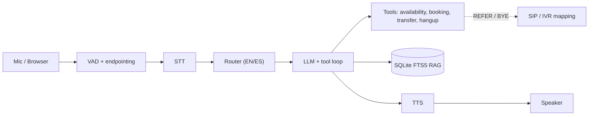

# Aurora — AI Voice Agent for Hotel Reservations


**By [Taimoor Raza](https://github.com/tr049)**

Aurora is a production-shaped **voice AI agent** that handles hotel reservations end to end:
it listens, books rooms, answers policy questions from a grounded knowledge base, switches
between English and Spanish, and hands off to a human when needed. It runs **fully offline**
against a deterministic mock, or **live** against OpenAI/Groq — and ships with a real-time
browser demo, an evaluation harness, and capacity-planning tooling.

The core turn pipeline:

```text
caller audio → VAD / endpointing → STT → router → LLM + tools → RAG → TTS → reply
```

## Highlights

- **Runs with zero setup.** The offline mock (rule-based LLM, scripted STT, no-op TTS) needs no API key, no network, and no third-party packages — so the whole agent / tools / RAG / routing / eval stack is runnable and testable instantly.
- **Provider-agnostic.** One OpenAI-dialect code path drives OpenAI, Groq, or the offline mock; switch with a single environment variable.
- **Grounded and guarded.** Hotel-only guardrails, function-calling tools for availability and booking, and a local **SQLite FTS5** retriever for policies — with deterministic pre-routing so knowledge questions always reach retrieval.
- **Bilingual.** Validated English/Spanish session state with matching TTS locale, changed only on an explicit request (never on an incidental foreign word).
- **Real-time browser demo.** A LiveKit room with client-side VAD, adaptive noise calibration, and **playback barge-in** — speak over the agent to interrupt it.
- **Observable.** Structured per-turn telemetry (stage latencies, tool I/O, retrieval sources) with **PII redaction on by default**.
- **Tested and measured.** Deterministic behavioral + red-team suites, plus a capacity calculator that turns traffic assumptions into peak concurrency and cost.
- **Telephony-aware.** SIP/IVR simulations map the agent's tool actions onto real call-control (`REFER` / `BYE`).

## Architecture

Three layers separate the real-time loop, the reasoning, and the telephony concerns:



- **Layer A — turn loop** (`pipeline/voice_loop.py` CLI, `livekit/talk_server.py` browser): capture → STT → agent → TTS, with per-stage latency timing.
- **Layer B — agent brain** (`pipeline/`): the LLM + tool loop, provider adapter, language router, FTS5 retriever, and telemetry.
- **Layer C — telephony** (`mocks/`): SIP/IVR simulation mapping tool actions to `REFER` / `BYE`.

## Tech stack

| Area | Choice |
|---|---|
| Language / tooling | Python 3.10+, [uv](https://docs.astral.sh/uv/) |
| LLM / STT / TTS | OpenAI or Groq (OpenAI-compatible), plus an offline mock |
| Retrieval | SQLite FTS5 — in-process, no external services |
| Audio | `webrtcvad`, `sounddevice` (microphone mode) |
| Real-time | LiveKit browser room, WebRTC, MediaRecorder |
| Server | Python stdlib `http.server` — no web framework |

## Quick start

No API key required — the offline path runs the full agent:

```bash
# 1) Offline — no key, no network, no dependencies
uv sync
uv run python pipeline/smoke_test.py                        # scripted end-to-end check
uv run python evals/run_evals.py --suite all                # behavioral + red-team evals
PROVIDER=mock uv run python pipeline/voice_loop.py --text   # talk to the agent in your terminal

# 2) Live provider (OpenAI or Groq)
uv sync --extra live
cp pipeline/config.example.env pipeline/.env                # set PROVIDER + your API key
uv run --env-file pipeline/.env python pipeline/voice_loop.py --text

# 3) Real microphone
uv sync --extra audio --extra live
uv run --env-file pipeline/.env python pipeline/voice_loop.py
```

Try these turns in text mode:

```text
What is the cancellation policy?
I need a room from August 12 to August 14 for two guests.
Please speak Spanish.
¿Cuál es la política de mascotas?
Connect me to the front desk.
```

## Browser demo (LiveKit)

```bash
cd livekit
uv sync --extra livekit --extra live
npm install                                     # browser SDK (uv does not manage Node deps)
./start_local_server.sh                         # terminal 1: local LiveKit dev server
uv run python create_room.py && uv run python talk_server.py   # terminal 2
# open http://localhost:5173 and click "Start call"
```

The UI shows a live transcript, grounding sources, and per-stage telemetry. Speak while the
agent is talking to trigger **barge-in**; two sliders tune endpoint-silence and speech
sensitivity relative to the measured noise floor.

## Testing

```bash
uv run python pipeline/smoke_test.py            # end-to-end smoke (mock)
uv run python pipeline/test_features.py         # unit suite: routing, RAG, redaction, scale
uv run python evals/run_evals.py --suite all    # behavioral + red-team evals
```

The red-team suite covers prompt injection, policy fabrication, PII protection, structured
tool input under an injection string, and guardrails after a language switch.

## Design notes

- **Truth boundaries by type.** Different kinds of truth use different mechanisms:

  | Information | Mechanism | Why |
  |---|---|---|
  | Policies, parking, pets, breakfast, accessibility | Local RAG | Read-oriented knowledge with source evidence |
  | Availability and room rates | Tool call | Dynamic operational truth |
  | Booking creation | Tool call | Auditable state change |
  | Language switching | `set_language` control tool | Validated session state + matching TTS locale |
  | Transfer / hangup | Control action | Runtime and telephony behavior |

- **Hybrid tool routing.** High-confidence policy/amenity phrases force the retrieval tool in application code before the first model call, so knowledge questions stay grounded after interruptions — without misrouting "cancel my reservation" into policy search.
- **Privacy-first telemetry.** Transcript and response content are omitted by default and sensitive fields (guest name, contact) are redacted; content capture is opt-in for controlled local debugging only.
- **Reproducible and cheap to iterate.** Everything critical runs on the mock, so tests and evals are deterministic and free.

## Configuration

Copy `pipeline/config.example.env` → `pipeline/.env`:

| Variable | Purpose |
|---|---|
| `PROVIDER` | `mock` / `openai` / `groq` |
| `OPENAI_API_KEY` / `GROQ_API_KEY` | only the selected live provider's key is required |
| `TTS_BACKEND` | `system` (local voice, free) or `provider` (cloud TTS) |
| `TELEMETRY_JSONL` | JSONL trace destination (unset = telemetry off) |
| `TELEMETRY_INCLUDE_CONTENT` | keep `false` outside local debugging |

## Project structure

```text
pipeline/     core runtime — agent, providers, router, RAG, telemetry, CLI loop, tests
livekit/      browser demo — stdlib HTTP bridge, LiveKit rooms, web client
mocks/        SIP/IVR telephony simulation
evals/        deterministic behavioral + red-team suites
knowledge/    hotel-policy corpus (RAG source)
pyproject.toml   uv project (extras: live / audio / livekit)
```

## Roadmap

- Room-native LiveKit agent worker (subscribe to the caller track, publish a TTS track) in place of the HTTP bridge.
- Persistent session storage and distributed turn cancellation.
- Real booking backend with authentication, validation, idempotency, and audit trail.
- SIP dispatch for live PSTN calls.

## Author

**Taimoor Raza**  ·  [github.com/tr049](https://github.com/tr049)  ·  [taimoor.raza7@gmail.com](mailto:taimoor.raza7@gmail.com)

## License

No license yet — add a `LICENSE` file (for example, MIT) before making the repository public.
